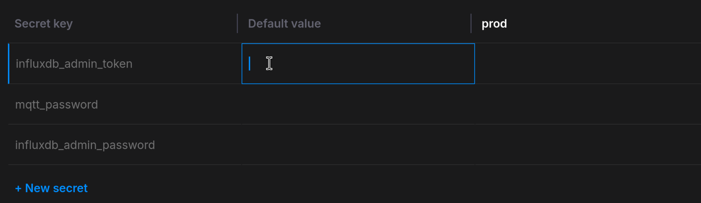
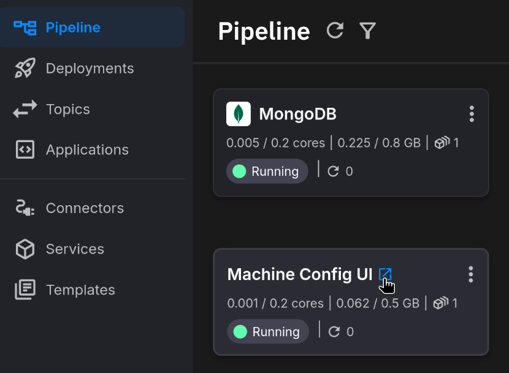

# HTTP Ingestion Pipeline Setup Guide

This guide walks you through the initial configuration of the HTTP Ingestion Pipeline template, including setting up secrets and verifying the deployment.

## Step 1: Configure Secrets

The template requires several secrets to be configured in your Quix environment. Quix manages secrets automatically during the synchronization process.

For more details on secrets management, see the [Quix Secrets Management documentation](https://quix.io/docs/deploy/secrets-management.html).

### Synchronization Flow

1. **Press the Sync button** in the top right corner of the Quix UI

   

2. **Quix will prompt you to add secrets** - enter values for any missing secrets

   

3. **Set all required secrets** - enter secure values for each secret

   

### Required Secrets

| Secret Key | Used By | Description |
|------------|---------|-------------|
| `influxdb_admin_token` | Grafana, InfluxDB2, InfluxDB2 Sink | Admin token for InfluxDB authentication |
| `influxdb_admin_password` | InfluxDB2 | Admin password for InfluxDB initialization |
| `http_auth_token` | HTTP API Source, HTTP Sink | Token for authenticating HTTP data submissions |
| `mongo_password` | MongoDB | Root password for MongoDB database |
| `config_ui_auth_token` | Machine Config UI | Token for authenticating with the configuration UI |

### Setting Up Secrets

#### InfluxDB Credentials (`influxdb_admin_token` and `influxdb_admin_password`)

InfluxDB2 is deployed fresh with your environment, so you define these credentials yourself:

1. **Choose a strong token** for `influxdb_admin_token` (e.g., a UUID or random string)
2. **Choose a strong password** for `influxdb_admin_password`

These values will be used to:
- Initialize InfluxDB2 with admin credentials
- Authenticate Grafana when querying InfluxDB
- Allow the InfluxDB2 Sink to write data

> **Important:** The `influxdb_admin_password` is also used as the Grafana admin password (username: `admin`). Store this value securely as you'll need it to log into Grafana.

#### HTTP Authentication Token (`http_auth_token`)

This token secures the HTTP API endpoint that receives external data:

1. **Choose a strong, unique token** for `http_auth_token`

This value will be used to:
- Authenticate incoming HTTP requests to the HTTP API Source
- Allow the HTTP Sink (mock data source) to send data to the HTTP API

#### MongoDB Password (`mongo_password`)

MongoDB is used as the backend for the Dynamic Configuration Manager:

1. **Choose a strong password** for `mongo_password`

This password will be used to:
- Initialize the MongoDB database with root credentials
- Allow the Configuration Manager to store and retrieve configurations

#### Config UI Authentication Token (`config_ui_auth_token`)

This token secures access to the Machine Config UI:

1. **Choose a memorable but secure token** for `config_ui_auth_token`

> **Important:** You'll need to enter this token when accessing the Machine Config UI, so store it somewhere accessible.

### Example Secret Configuration

```
influxdb_admin_token:    my-secure-influx-token-2024
influxdb_admin_password: MyInfluxP@ssw0rd!
http_auth_token:         http-api-secret-token-xyz
mongo_password:          MongoSecureP@ss!2024
config_ui_auth_token:    config-ui-access-token
```

> **Warning:** These secrets act as an authentication layer since some services are openly accessible to the internet. **DO NOT use weak passwords.**

> **Important:** Store these credentials securely. Once set, you cannot retrieve them from Quix - you can only overwrite them with new values.

## Step 2: Verify Deployment

After the synchronization completes, verify all services are running:

1. **Check Deployment Status** - Ensure all services start successfully. It is normal for some services to restart a few times while dependencies are starting up.

2. **Core Pipeline Services:**
   - HTTP API Source
   - HTTP Data Normalization
   - HTTP Config Enricher
   - InfluxDB2 Sink
   - Machine Config UI
   - Dynamic Configuration Manager

3. **Auxiliary Services (Aux services group):**
   - InfluxDB2
   - MongoDB

4. **Mock Data Source (Mock Data Source group):**
   - OPC UA Server
   - OPC UA Source
   - HTTP Sink

5. **Visualization:**
   - Grafana

> **Note:** Applications should not need to restart more than 3-5 times before everything is up and running.

## Step 3: Access the Services

### Accessing Grafana

1. Click on the **Grafana** deployment and find the public URL link

   

2. Log in with:
   - **Username:** `admin`
   - **Password:** The value you set for `influxdb_admin_token`

   

3. Navigate to the dashboards tab

   

4. Explore the pre-configured dashboard

   

### Accessing Machine Config UI

1. Click on the **Machine Config UI** deployment and find the public URL link

   

2. Enter the token you set for `config_ui_auth_token`

   

3. Use the UI to configure machine parameters

   

## Step 4: Verify Data Flow

Once all services are running:

1. **Check the Mock Data Source** - The OPC UA Server generates sample data, which flows through OPC UA Source and HTTP Sink to the HTTP API Source

2. **Verify data in Grafana** - Open the Grafana dashboard to see incoming sensor data visualized

3. **Test Configuration** - Use the Machine Config UI to modify field mappings and scalars, then observe the changes in Grafana

## Troubleshooting

### Services failing to start
- Verify all secrets are configured correctly
- Check that secret names match exactly (case-sensitive)
- Allow 3-5 restart cycles for services to initialize dependencies

### Cannot access Grafana
- Ensure `influxdb_admin_token` secret is set
- Verify you're using `admin` as the username
- Check Grafana deployment logs for errors

### No data appearing in Grafana
- Verify the Mock Data Source services are running (OPC UA Server, OPC UA Source, HTTP Sink)
- Check HTTP API Source logs for incoming requests
- Verify `http_auth_token` matches between HTTP API Source and HTTP Sink

### Machine Config UI authentication fails
- Verify `config_ui_auth_token` is set correctly
- Ensure you're entering the exact token value (no extra spaces)

### MongoDB connection errors
- Verify `mongo_password` is set correctly
- Check MongoDB deployment is running and healthy
- Review Dynamic Configuration Manager logs for connection details

### InfluxDB write errors
- Verify `influxdb_admin_token` matches across InfluxDB2, InfluxDB2 Sink, and Grafana
- Check that InfluxDB2 has finished initializing (may take a minute on first start)
